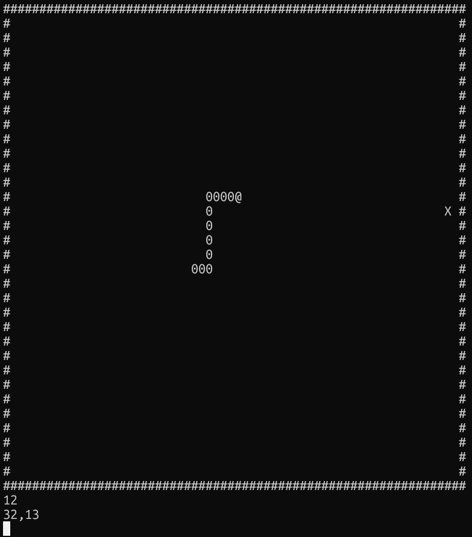

# 🐍 CLI-snake-game

A Snake game that runs directly in your terminal, built with Node.js.


## Requirements

- [Docker](https://www.docker.com/get-started) — no Node.js needed

## Run

```bash
docker run -it viktorevsky/cli-snake
```
That's it. Docker will pull the image automatically if you don't have it.

## Controls

| Key | Action |
|-----|--------|
| `↑` | Up |
| `↓` | Down |
| `←` | Left |
| `→` | Right |
| `ctrl + c` | Quit |

## Built with

- Node.js
- Docker